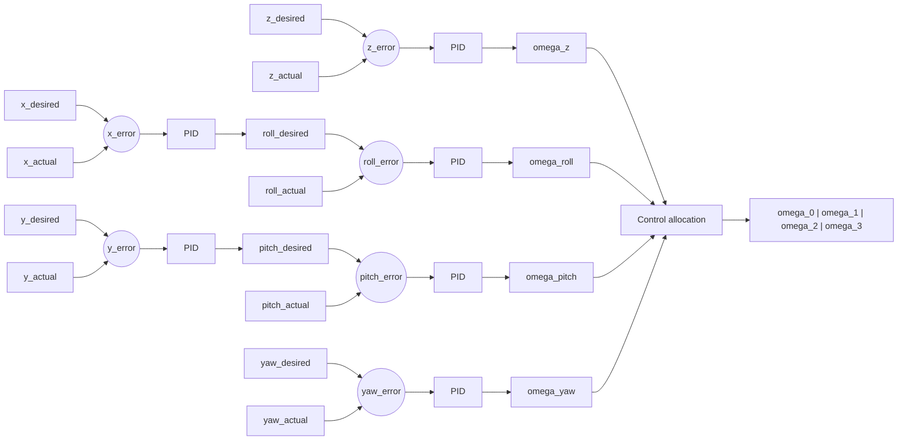

# RAT-LAB PID Controller (ROS 2 Gazebo Drone Simulation)

This repository provides a ROS 2-based simulation environment for a drone running in **Gazebo**, along with nodes for pose listening and command publishing.

It uses ROS 2 for communication between nodes and Gazebo for physics-based drone simulation.

---

## 📌 Features

-   Drone simulation in Gazebo
-   ROS 2-based architecture
-   Launch file to spawn and control drone in simulation
-   Pose listener node for tracking drone state
-   Command publisher node for sending control inputs
-   Modular setup for testing PID control systems

---

## ⚙️ Prerequisites

Make sure you have the following installed:

-   ROS 2 (Jazzy recommended)
-   Gazebo (compatible version with ROS 2 Jazzy)
-   `colcon` build tools
-   `git`

Source ROS 2 before running any commands:

bash

Copy

```bash
source /opt/ros/jazzy/setup.bash
```

---

## 📁 Workspace Setup

Create a ROS 2 workspace and clone the repository:

bash

Copy

```bash
mkdir -p rat-lab-ws/srccd rat-lab-ws/srcgit clone -b pid-controller https://github.com/UPB-RAT/nonlinear_control_course_ss26.gitshopt -s dotglob && mv nonlinear_control_course_ss26/* . && rmdir nonlinear_control_course_ss26
```

---

## 🔨 Build Instructions

From the workspace root:

bash

Copy

```bash
cd ../..colcon build
```

After building, source the workspace:

bash

Copy

```bash
source install/setup.bash
```

---

## 🚀 Running the Simulation with Twist based control

We have provided a working Quadcopter PID controller using Twist message for position control. Simulation to run this version

### 1\. Launch Drone Simulation (Gazebo)

Open a new terminal:

bash

Copy

```bash
source /opt/ros/jazzy/setup.bashsource install/setup.bashros2 launch drone_simulation twist.sim.launch.py
```

This will:

-   Start Gazebo
-   Spawn the drone model
-   Initialize simulation environment

---

### 2\. Commands to run the Twist PID controller

Open a new terminal:

bash

Copy

```bash
source /opt/ros/jazzy/setup.bashsource install/setup.bashros2 launch drone_pid_controller drone_twist.launch.py 
```

---

### 3\. Commands to run the Twist PID controller with minimum snap

Open another terminal:

bash

Copy

```bash
source /opt/ros/jazzy/setup.bashsource install/setup.bashros2 launch drone_pid_controller drone_twist_snap.launch.py 
```

## 🚀 Instructions for Homework 1, Question 3 submission

We have already provided you with boilerplate code for the PID control in the file "drone\_pid\_controller/drone\_controller.py". Students are required to add the required code in the respective TODO sections and make sure the full code works successfully. You can make changes at other sections of the code if required.

### 1\. Launch Drone Simulation (Gazebo)

Open a new terminal:

bash

Copy

```bash
source /opt/ros/jazzy/setup.bashsource install/setup.bashros2 launch drone_simulation sim.launch.py
```

This will:

-   Start Gazebo
-   Spawn the drone model
-   Initialize simulation environment

---

### 2\. Commands to run the PID controller

Open a new terminal:

bash

Copy

```bash
source /opt/ros/jazzy/setup.bashsource install/setup.bashros2 launch drone_pid_controller drone.launch.py 
```

---

## Controller Design diagram


## Base Speed Calculation (System Dynamics)

### 1. System Parameters  
From the SDF-based quadcopter model implemented in Gazebo:

- Mass: $m = 1.5 \,\text{kg}$  
- Gravitational acceleration: $g = 9.81 \,\text{m/s}^2$  
- Thrust coefficient (Gazebo motor model):  
  $$
  k_f = 8.54858 \times 10^{-6}
  $$
- Rotor configuration: symmetric X-configuration with four identical motors  

Each rotor produces thrust according to:

$$
T_i = k_f \omega_i^2
$$

where $\omega_i$ is the angular velocity of rotor $i$.

---

### 2. Hover Equilibrium Condition  
In steady hover, total thrust balances weight:

$$
\sum_{i=1}^{4} T_i = mg
$$

Assuming symmetric operation:

$$
\omega_1 = \omega_2 = \omega_3 = \omega_4 = \omega_b
$$

Substituting:

$$
4 k_f \omega_b^2 = mg
$$

This is the equilibrium condition with zero vertical acceleration.

---

### 3. Analytical Solution for Base Rotor Speed  

$$
\omega_b = \sqrt{\frac{mg}{4k_f}}
$$

Substituting values:

$$
\omega_b = \sqrt{\frac{1.5 \cdot 9.81}{4 \cdot 8.54858 \times 10^{-6}}}
$$

$$
\omega_b \approx 656 \,\text{rad/s}
$$

This is the theoretical hover speed under ideal assumptions (no losses, perfect actuation).

---

### 4. Implementation Value and Simulation Tuning  

The controller uses:

$$
\omega_{\text{base}} = 636 \,\text{rad/s}
$$

The difference from the analytical value (~656 rad/s) is due to:

- Aerodynamic drag and unmodeled rotor losses in Gazebo  
- First-order actuator dynamics in the simulation plugin  
- Simplifications in the thrust model  
- Empirical tuning for stable PID hover control  

Thus, $\omega_{\text{base}}$ represents a **simulation-calibrated equilibrium point**, not the ideal theoretical value.